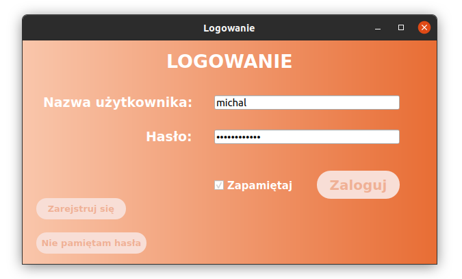
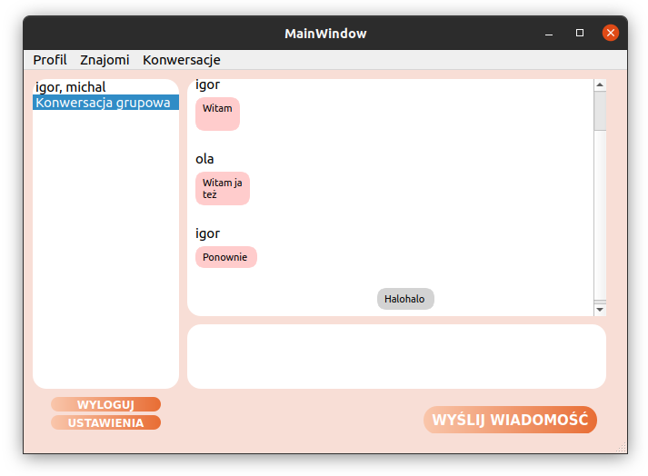
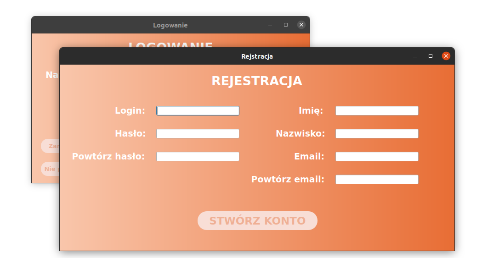

# PeaChat
## Spis treści
* [Technologies](#technologies)
* [General info](#general-info)
* [Application description](#application-description)

	

## Technologie

 

 

 
 
 
 
 

## Głowne informacje
Projekt studencki tworzony w ramach Kursu Wybranego Języka Programowania (Python).

Tworzony przez:
* [Igor Cichecki]()
* [Michał Janik](https://github.com/mihal09)
* [Paweł Kubala](https://github.com/Kubciooo)
* [Maciej Lewandowicz](https://github.com/sasuke5055)
* [Aleksandra Romanowska]()
* [Piotr Szymański](https://github.com/PitiMonster)

## Opis Aplikacji
Celem projektu było stworzenie komunikatora opartego o technologię client-server. 
Backend został stworzony z wykorzystaniem Django, frontend z wykorzystaniem PyQt5. 

Komunikacja clienta z serweram odbywała się za pośrednictwem websocketów. 

W trakcie trwania kursu udało się zaimplementować:
* Wysyłanie i odbieranie wiadomości
* Konwersacje grupowe
* System znajomości - wyszukiwanie, dodawanie, usuwanie znajomych
* System zaproszeń - wysyłanie, akceptowanie, odrzucanie zaproszeń do znajomych
* Obsługę rejestracji użytkowników, zmianę haseł, logowanie do systemu

Okno logowania:

Głowne okno aplikacji:

Konwersacja grupowa:

Wyszukiwanie i dodawanie nowych znajomych:

Rejestracja nowego użytkownika:

